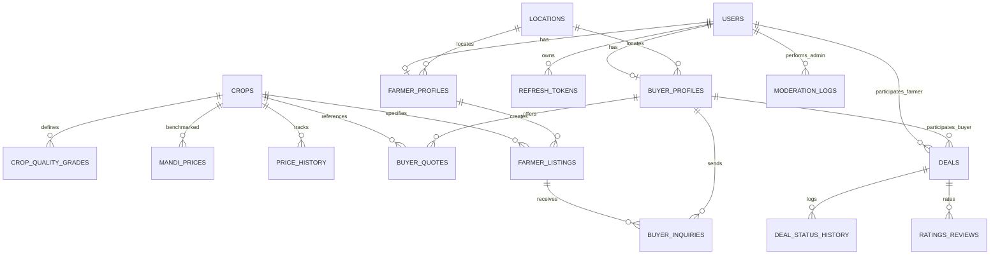

# KisanLink — Backend Requirements Specification
**Problem Statement Reference:** SIH26132 — *Strengthening Market Linkages and Price Discovery for Farmers*  
**Document Version:** 1.0.0  
**Target Architecture:** Multi-Role RESTful API (Farmer, Buyer, Administrator)

---

## 1. Executive Summary & System Overview

KisanLink is a digital agricultural marketplace and price discovery platform designed to solve information asymmetry for farmers. Rather than showing only gross mandi prices, the platform calculates the **real net take-home return** by deducting estimated transport costs, mandi/commission fees, and loading/handling charges across APMC Mandis, Farmer Producer Organisations (FPOs), and Private Buyers.

The system supports three user personas:
1. **Farmers**: Discover optimal selling channels, view 7-day price trends with sell/wait recommendations, use voice-assisted search, and manage 7-stage deal lifecycles.
2. **Buyers**: View nearby farmer crop listings, check asking rates, and initiate direct procurement leads.
3. **Administrators**: Moderate price quotes, verify buyer authenticity, and track platform transaction health.

---

## 2. Frontend Inventory & Architecture Analysis

### 2.1 Pages & Views (SPA Screen States)
| Screen ID | UI Identifier | Access Role | Core Functionality |
|---|---|---|---|
| **Login Screen** | `#loginScreen` | Public / All | Role-based authentication (Farmer, Buyer, Admin) with language toggle |
| **Farmer Dashboard** | `#farmerView` | Farmer | Market ticker, voice input, net take-home calculator, 7-day trend, ranked buyer cards |
| **Buyer Dashboard** | `#buyerView` | Buyer | Key procurement metrics, live farmer harvest listings feed, direct farmer outreach |
| **Admin Dashboard** | `#adminView` | Administrator | System statistics, quote & listing moderation table with approval/removal workflows |
| **Deal Workflow Modal** | `#dealModal` | Farmer / Buyer | 7-step transaction lifecycle tracker from offer creation to rating completion |

### 2.2 Reusable UI Components
- **Top Navigation Bar (`header.top`)**: Brand identity, language selector, user greeting pill (`.role-pill`), and session logout button.
- **Language Switcher (`.lang-switch`)**: Multilingual toggle supporting English (`en`), Telugu (`te`), and Hindi (`hi`).
- **Live Mandi Price Ticker (`.price-ticker`)**: Commodity price chips showing current rate/kg and last-updated time.
- **Voice Input Widget (`.voice-row`, `#micBtn`)**: Web Speech API speech-to-text trigger parsing crop name and quantity.
- **Crop Inquiry Form Card (`.form-card`)**: Crop, quantity, unit, location, and quality grade inputs.
- **FPO Information Banner (`.fpo-banner`)**: Visual education flow demonstrating aggregation benefits.
- **Price Trend & Decision Advisory Card (`.trend-card`)**: 7-day sparkline bar chart, price sequence, demand level, and Sell/Wait recommendation pill.
- **Ranked Buyer Cards (`#cardList`, `.card`)**: Displays buyer type (Mandi, FPO, Private), distance (km), verified badge, rating, 4-tier cost breakdown, net payout, and action button.
- **Methodology Explainer Box (`.method-note`)**: Formula transparency disclosure.
- **Stat Metric Cards (`.stat-row`)**: Quantitative summary cards on Buyer and Admin dashboards.
- **Buyer Listing Rows (`.listing-row`)**: Crop badge, farmer details, asking price, and inquiry button.
- **Admin Moderation Table (`.admin-table`)**: Data table with status tags (`Verified`, `Needs review`, `Pending`) and moderation actions.
- **Toast Feedback Component (`#toast`)**: Floating notification message box.

### 2.3 User Forms & Inputs
1. **Authentication Form**:
   - Role Selector: `farmer` | `buyer` | `admin`
   - Full Name: String
   - Mobile Number / Admin ID: 10 digits for Farmer/Buyer; alphanumeric string for Admin
   - Password: Password string
2. **Farmer Price Discovery & Calculator Form**:
   - Crop: Dropdown (`tomato`, `onion`, `soybean`, `cotton`, `wheat`)
   - Quantity: Number (min: 1)
   - Quantity Unit: Dropdown (`kg`, `quintal`)
   - Location: Dropdown (`warangal`, `karimnagar`, `nalgonda`, `khammam`, `adilabad`)
   - Quality Grade: Selector pills (`A` - Grade A, `B` - Grade B, `C` - Grade C)

### 2.4 Buttons Requiring Backend Endpoints
| Button / Trigger | Current Frontend Action | Required Backend Functionality |
|---|---|---|
| **Log In (`.btn-login`)** | Validates length, swaps DOM views | Authenticates credentials, issues JWT tokens, returns user profile |
| **Log Out (`.btn-logout`)** | Resets inputs, shows login screen | Invalidates refresh token, logs audit event |
| **Find Best Buyers (`.btn-primary`)** | Calls local JS `computeResults()` | Executes price discovery algorithm, calculates distance & fees, returns ranked buyers |
| **Send Offer (`.btn-contact`)** | Opens `#dealModal` | Creates new deal record (`OFFER_SENT`), notifies buyer |
| **Advance Deal (`#dealNextBtn`)** | Increments local `dealStage` counter | Transitions deal stage, validates state machine, records audit log |
| **Contact Farmer (`.btn-small`)** | Shows local toast notification | Creates buyer inquiry record, sends push/SMS notification to farmer |
| **Admin Approve (`.admin-actions button`)** | Displays confirmation toast | Updates listing status to `VERIFIED` in database |
| **Admin Remove (`.admin-actions button`)** | Displays removal toast | Updates listing status to `REJECTED` / soft-deletes |
| **Voice Input (`#micBtn`)** | Client-side SpeechRecognition | Optional backend fallback for vernacular audio transcription and NLP slot extraction |

---

## 3. Detailed Data Inventory (Current Hardcoded / Mock Data)

### 3.1 Crops & Base Benchmark Pricing
| Crop Key | Commodity | Icon | Base Price (₹/kg) | Hardcoded 7-Day Trend (D-6 to Today) |
|---|---|---|---|---|
| `tomato` | Tomato | 🍅 | ₹18.00 | `[14, 15, 15, 17, 16, 18, 18]` |
| `onion` | Onion | 🧅 | ₹14.00 | `[16, 15, 15, 14, 14, 13, 14]` |
| `soybean` | Soybean | 🌱 | ₹44.00 | `[41, 42, 43, 43, 44, 44, 44]` |
| `cotton` | Cotton | 🌾 | ₹62.00 | `[58, 59, 60, 61, 61, 62, 62]` |
| `wheat` | Wheat | 🌿 | ₹24.00 | `[25, 25, 24, 24, 24, 24, 24]` |

### 3.2 Quality Multipliers
- **Grade A**: Multiplier `1.00` (100% of benchmark)
- **Grade B**: Multiplier `0.88` (88% of benchmark)
- **Grade C**: Multiplier `0.74` (74% of benchmark)

### 3.3 Buyer Templates & Calculation Parameters
| Buyer / Market Name | Type | Base Dist (km) | Price Mult | Commission Fee | Freshness String | Verified | Rating | Deals |
|---|---|---|---|---|---|---|---|---|
| **Warangal APMC Market** | `mandi` | 12 | 1.00 | 6.0% | Updated 40 min ago | Yes | 4.6 | 212 |
| **Sahyadri Farmers FPO** | `fpo` | 22 | 1.05 | 3.0% | Updated 2 hr ago | Yes | 4.8 | 340 |
| **Green Harvest Traders** | `private` | 8 | 0.94 | 2.0% | Updated 1 hr ago | Yes | 4.1 | 76 |
| **Lasalgaon Wholesale Mandi** | `mandi` | 35 | 1.10 | 6.0% | Updated 3 hr ago | Yes | 4.4 | 501 |
| **Krishi Setu Cooperative** | `fpo` | 18 | 1.02 | 2.5% | Updated 5 hr ago | Yes | 4.7 | 158 |
| **Om Sai Agro Buyers** | `private` | 15 | 0.97 | 2.0% | Updated 55 min ago | No | 3.6 | 9 |

### 3.4 Location Distance Multipliers (Simulated GIS)
- `warangal`: `1.0`
- `karimnagar`: `1.3`
- `nalgonda`: `1.6`
- `khammam`: `1.1`
- `adilabad`: `1.4`

### 3.5 Core Calculation Formulas
$$\text{PricePerKg} = \text{CropBase} \times \text{BuyerPriceMultiplier} \times \text{QualityMultiplier}$$
$$\text{Gross} = \text{PricePerKg} \times \text{QuantityInKg}$$
$$\text{DistanceKm} = \text{BuyerBaseDistance} \times \text{LocationSpreadMultiplier}$$
$$\text{TransportCost} = \text{DistanceKm} \times 2.1 \times \left(\frac{\text{QuantityInKg}}{100}\right)$$
$$\text{MarketFee} = \text{Gross} \times \text{BuyerCommissionRate}$$
$$\text{HandlingCost} = 40 + (\text{QuantityInKg} \times 0.06)$$
$$\mathbf{NetTakeHome} = \text{Gross} - \text{TransportCost} - \text{MarketFee} - \text{HandlingCost}$$

### 3.6 Transaction Lifecycle Stages (`DEAL_STAGES`)
1. `Offer sent`: Farmer initiates offer with price, quantity, and grade.
2. `Buyer accepts`: Buyer reviews and agrees to offer.
3. `Deal confirmed`: Contract terms locked (quantity, price, pickup/delivery window).
4. `Dispatch`: Produce departs origin farm location.
5. `Delivery`: Consignment arrives at buyer hub/mandi; physical weight & assaying verified.
6. `Payment`: Funds disbursed to farmer bank account / UPI.
7. `Rate buyer`: Transaction finalized with mutual review rating.

### 3.7 Buyer Feed Mock Listings
- Ramesh Patil — Tomato (600 kg) — Narsampet, Warangal — Ask ₹19/kg — Updated 20m ago
- Sunita Jadhav — Onion (1.2 quintal) — ReddyPalem, Warangal — Ask ₹15/kg — Updated 1h ago
- Vikas More — Soybean (800 kg) — Kopargaon, Khammam — Ask ₹45/kg — Updated 2h ago
- Anita Deshmukh — Cotton (3 quintal) — KilaWarangal, Warangal — Ask ₹63/kg — Updated 3h ago
- Prakash Salunkhe — Wheat (5 quintal) — Baramati, Karimnagar — Ask ₹25/kg — Updated 4h ago

### 3.8 Admin Moderation Mock Data
- Warangal APMC Market — Tomato — Updated 40m ago — Status: `ok`
- Lasalgaon Wholesale Mandi — Onion — Updated 3h ago — Status: `ok`
- Unverified Buyer #4471 — Cotton — Updated 29h ago — Status: `flag`
- Om Sai Agro Buyers — Soybean — Updated 55m ago — Status: `ok`
- Prakash Traders — Wheat — Updated 5m ago — Status: `pending`
- Green Harvest Traders — Tomato — Updated 31h ago — Status: `flag`

---

## 4. Database Architecture & Schema Design

### 4.1 Required Database Tables



---

### 4.2 Table Definitions

#### 1. `users`
Core user identity for all system roles.
- `id`: UUID (Primary Key, default `gen_random_uuid()`)
- `phone`: VARCHAR(15) (Unique, Indexed, required for Farmer & Buyer)
- `admin_code`: VARCHAR(50) (Unique, Nullable, required for Administrator)
- `password_hash`: VARCHAR(255) (Required)
- `full_name`: VARCHAR(100) (Required)
- `role`: VARCHAR(20) (Enum: `'farmer'`, `'buyer'`, `'admin'`)
- `preferred_language`: VARCHAR(5) (Default `'en'`, values: `'en'`, `'te'`, `'hi'`)
- `is_active`: BOOLEAN (Default `true`)
- `created_at`: TIMESTAMPTZ (Default `NOW()`)
- `updated_at`: TIMESTAMPTZ (Default `NOW()`)

#### 2. `farmer_profiles`
Extended profile for registered agricultural producers.
- `id`: UUID (Primary Key)
- `user_id`: UUID (Foreign Key $\rightarrow$ `users.id` ON DELETE CASCADE, Unique)
- `village`: VARCHAR(100) (Required)
- `mandal`: VARCHAR(100)
- `location_id`: UUID (Foreign Key $\rightarrow$ `locations.id`)
- `land_size_acres`: NUMERIC(5,2)
- `upi_id`: VARCHAR(50)
- `bank_account_number`: VARCHAR(30)
- `bank_ifsc`: VARCHAR(20)
- `created_at`: TIMESTAMPTZ (Default `NOW()`)

#### 3. `buyer_profiles`
Extended profile for mandis, FPOs, and private agricultural traders.
- `id`: UUID (Primary Key)
- `user_id`: UUID (Foreign Key $\rightarrow$ `users.id` ON DELETE CASCADE, Unique)
- `business_name`: VARCHAR(150) (Required)
- `buyer_type`: VARCHAR(20) (Enum: `'mandi'`, `'fpo'`, `'private'`)
- `location_id`: UUID (Foreign Key $\rightarrow$ `locations.id`)
- `address_details`: TEXT
- `latitude`: NUMERIC(9,6) (For geospatial distance)
- `longitude`: NUMERIC(9,6)
- `license_number`: VARCHAR(100)
- `is_verified`: BOOLEAN (Default `false`)
- `rating_average`: NUMERIC(3,2) (Default `0.00`)
- `total_deals_count`: INT (Default `0`)
- `commission_rate`: NUMERIC(4,3) (e.g. 0.06 for 6%)
- `created_at`: TIMESTAMPTZ (Default `NOW()`)

#### 4. `locations`
Standardized geographical districts / logistics hubs.
- `id`: UUID (Primary Key)
- `slug`: VARCHAR(50) (Unique, e.g. `'warangal'`, `'karimnagar'`)
- `name`: VARCHAR(100) (e.g. `'Warangal'`)
- `state`: VARCHAR(100) (Default `'Telangana'`)
- `latitude`: NUMERIC(9,6)
- `longitude`: NUMERIC(9,6)
- `spread_factor`: NUMERIC(3,2) (Distance multiplier fallback)

#### 5. `crops`
Catalog of supported commodities.
- `id`: UUID (Primary Key)
- `slug`: VARCHAR(50) (Unique, e.g. `'tomato'`, `'onion'`)
- `name_en`: VARCHAR(100)
- `name_te`: VARCHAR(100)
- `name_hi`: VARCHAR(100)
- `icon_char`: VARCHAR(10) (e.g. `'🍅'`)
- `category`: VARCHAR(50) (e.g. `'vegetable'`, `'grain'`, `'commercial'`)
- `standard_unit`: VARCHAR(20) (Default `'kg'`)
- `base_benchmark_price`: NUMERIC(10,2)

#### 6. `crop_quality_grades`
Grading multipliers associated with commodities.
- `id`: UUID (Primary Key)
- `crop_id`: UUID (Foreign Key $\rightarrow$ `crops.id`)
- `grade_code`: VARCHAR(5) (Enum: `'A'`, `'B'`, `'C'`)
- `price_multiplier`: NUMERIC(4,3) (e.g. 1.000, 0.880, 0.740)
- `criteria_description`: TEXT

#### 7. `price_history`
7-day daily modal prices for sparkline and trend advisory.
- `id`: UUID (Primary Key)
- `crop_id`: UUID (Foreign Key $\rightarrow$ `crops.id`)
- `location_id`: UUID (Foreign Key $\rightarrow$ `locations.id`)
- `price_date`: DATE
- `modal_price_per_kg`: NUMERIC(10,2)
- Unique constraint on `(crop_id, location_id, price_date)`

#### 8. `buyer_quotes`
Pricing rules and bids configured by or mapped to buyers.
- `id`: UUID (Primary Key)
- `buyer_id`: UUID (Foreign Key $\rightarrow$ `buyer_profiles.id`)
- `crop_id`: UUID (Foreign Key $\rightarrow$ `crops.id`)
- `price_multiplier`: NUMERIC(4,3) (Relative to crop base)
- `commission_override`: NUMERIC(4,3) (Optional override)
- `status`: VARCHAR(20) (Enum: `'active'`, `'pending'`, `'flagged'`, `'rejected'`)
- `last_verified_at`: TIMESTAMPTZ (Default `NOW()`)
- `created_at`: TIMESTAMPTZ (Default `NOW()`)

#### 9. `farmer_listings`
Produce lots posted by farmers seeking buyers.
- `id`: UUID (Primary Key)
- `farmer_id`: UUID (Foreign Key $\rightarrow$ `farmer_profiles.id`)
- `crop_id`: UUID (Foreign Key $\rightarrow$ `crops.id`)
- `quantity`: NUMERIC(10,2)
- `unit`: VARCHAR(20) (Enum: `'kg'`, `'quintal'`)
- `quantity_in_kg`: NUMERIC(10,2) (Calculated for indexing)
- `quality_grade`: VARCHAR(5) (Enum: `'A'`, `'B'`, `'C'`)
- `asking_price_per_kg`: NUMERIC(10,2)
- `village`: VARCHAR(100)
- `location_id`: UUID (Foreign Key $\rightarrow$ `locations.id`)
- `status`: VARCHAR(20) (Enum: `'active'`, `'in_deal'`, `'completed'`, `'cancelled'`)
- `created_at`: TIMESTAMPTZ (Default `NOW()`)

#### 10. `deals`
B2B Transaction contract instances between farmer and buyer.
- `id`: UUID (Primary Key)
- `deal_code`: VARCHAR(20) (Unique, human-readable e.g. `'KL-2026-9041'`)
- `farmer_id`: UUID (Foreign Key $\rightarrow$ `farmer_profiles.id`)
- `buyer_id`: UUID (Foreign Key $\rightarrow$ `buyer_profiles.id`)
- `listing_id`: UUID (Foreign Key $\rightarrow$ `farmer_listings.id`, Nullable)
- `crop_id`: UUID (Foreign Key $\rightarrow$ `crops.id`)
- `quantity_kg`: NUMERIC(10,2)
- `agreed_price_per_kg`: NUMERIC(10,2)
- `gross_amount`: NUMERIC(12,2)
- `transport_cost`: NUMERIC(10,2)
- `market_fee`: NUMERIC(10,2)
- `handling_cost`: NUMERIC(10,2)
- `net_farmer_amount`: NUMERIC(12,2)
- `current_stage`: VARCHAR(30) (Enum: `'OFFER_SENT'`, `'BUYER_ACCEPTED'`, `'DEAL_CONFIRMED'`, `'DISPATCHED'`, `'DELIVERED'`, `'PAID'`, `'COMPLETED_RATED'`)
- `payment_reference`: VARCHAR(100)
- `created_at`: TIMESTAMPTZ (Default `NOW()`)
- `updated_at`: TIMESTAMPTZ (Default `NOW()`)

#### 11. `deal_status_history`
Immutable audit log of deal transitions.
- `id`: UUID (Primary Key)
- `deal_id`: UUID (Foreign Key $\rightarrow$ `deals.id` ON DELETE CASCADE)
- `stage`: VARCHAR(30)
- `actor_user_id`: UUID (Foreign Key $\rightarrow$ `users.id`)
- `notes`: TEXT
- `timestamp`: TIMESTAMPTZ (Default `NOW()`)

#### 12. `buyer_inquiries`
Contact requests initiated by buyers from the buyer dashboard.
- `id`: UUID (Primary Key)
- `buyer_id`: UUID (Foreign Key $\rightarrow$ `buyer_profiles.id`)
- `listing_id`: UUID (Foreign Key $\rightarrow$ `farmer_listings.id`)
- `status`: VARCHAR(20) (Enum: `'pending'`, `'contacted'`, `'declined'`, `'converted'`)
- `created_at`: TIMESTAMPTZ (Default `NOW()`)

#### 13. `ratings_reviews`
Feedback submitted upon deal completion.
- `id`: UUID (Primary Key)
- `deal_id`: UUID (Foreign Key $\rightarrow$ `deals.id` ON DELETE CASCADE)
- `reviewer_user_id`: UUID (Foreign Key $\rightarrow$ `users.id`)
- `reviewee_user_id`: UUID (Foreign Key $\rightarrow$ `users.id`)
- `rating_stars`: INT (Check: $1 \le \text{rating\_stars} \le 5$)
- `comment`: TEXT
- `created_at`: TIMESTAMPTZ (Default `NOW()`)

#### 14. `moderation_logs`
Audit log of admin actions on listings and quotes.
- `id`: UUID (Primary Key)
- `admin_user_id`: UUID (Foreign Key $\rightarrow$ `users.id`)
- `target_type`: VARCHAR(30) (`'buyer_quote'`, `'farmer_listing'`)
- `target_id`: UUID
- `action`: VARCHAR(20) (`'approved'`, `'rejected'`, `'flagged'`)
- `reason`: TEXT
- `timestamp`: TIMESTAMPTZ (Default `NOW()`)

#### 15. `refresh_tokens`
Secure token storage for session rotation.
- `id`: UUID (Primary Key)
- `user_id`: UUID (Foreign Key $\rightarrow$ `users.id` ON DELETE CASCADE)
- `token_hash`: VARCHAR(255) (Unique)
- `expires_at`: TIMESTAMPTZ
- `created_at`: TIMESTAMPTZ (Default `NOW()`)

---

## 5. Authentication & Authorization Specification

### 5.1 Architecture
- **Token Mechanism**: Stateless JSON Web Tokens (JWT).
  - `access_token`: Short-lived (15 minutes). Sent in `Authorization: Bearer <token>` header.
  - `refresh_token`: Long-lived (7 days). Stored in secure `HttpOnly`, `SameSite=Strict` cookie or rotated securely.
- **Password Security**: Bcrypt with minimum 12 salt rounds (or Argon2id).
- **Identifier Handling**:
  - `farmer` & `buyer`: Mandatory 10-digit Indian mobile number (`/^[6-9]\d{9}$/`).
  - `admin`: Validated against alphanumeric `admin_code`.

### 5.2 Role-Based Access Control (RBAC) Matrix
| Resource / Action | Public / Anon | Farmer | Buyer | Admin |
|---|---|---|---|---|
| Register / Login | ✅ | ✅ | ✅ | ✅ |
| View Public Ticker & Trends | ✅ | ✅ | ✅ | ✅ |
| Calculate Net Return | ❌ | ✅ | ❌ | ✅ |
| Initiate Deal (`Send offer`) | ❌ | ✅ | ❌ | ❌ |
| Advance Deal Status | ❌ | ✅ (Farmer steps) | ✅ (Buyer steps) | ✅ |
| View Buyer Feed Listings | ❌ | ❌ | ✅ | ✅ |
| Contact Farmer (`buyer_inquiries`) | ❌ | ❌ | ✅ | ❌ |
| Admin Moderation Table | ❌ | ❌ | ❌ | ✅ |
| Approve / Remove Listing | ❌ | ❌ | ❌ | ✅ |

---

## 6. Required REST API Endpoints

### 6.1 Authentication Module

#### `POST /api/v1/auth/login`
Authenticates a user and establishes session.
- **Frontend Page**: Login Screen (`#loginScreen`, `.btn-login`)
- **Headers**: `Content-Type: application/json`
- **Request Body**:
```json
{
  "role": "farmer",
  "identifier": "9876543210",
  "password": "secretPassword123",
  "full_name": "Ramesh Patil"
}
```
- **Validation Rules**:
  - `role`: Required, must be one of `["farmer", "buyer", "admin"]`.
  - `identifier`: If `farmer` or `buyer`, must be 10 numeric digits. If `admin`, non-empty string.
  - `password`: Non-empty, minimum 6 characters.
- **Success Response (`200 OK`)**:
```json
{
  "success": true,
  "data": {
    "user": {
      "id": "c1f7b764-bca8-4d56-b072-887e59b2d312",
      "full_name": "Ramesh Patil",
      "role": "farmer",
      "phone": "9876543210",
      "preferred_language": "en"
    },
    "tokens": {
      "access_token": "eyJhbGciOi...",
      "expires_in": 900
    }
  }
}
```
- **Error Response (`401 Unauthorized`)**:
```json
{
  "success": false,
  "error": {
    "code": "AUTH_INVALID_CREDENTIALS",
    "message": "Invalid mobile number or password."
  }
}
```

#### `POST /api/v1/auth/logout`
Invalidates active refresh tokens.
- **Frontend Page**: Top Bar (`.btn-logout`)
- **Headers**: `Authorization: Bearer <token>`
- **Success Response (`200 OK`)**:
```json
{
  "success": true,
  "message": "Successfully logged out."
}
```

#### `GET /api/v1/auth/me`
Fetches current authenticated user context and profile.
- **Frontend Page**: Shared header initialization
- **Headers**: `Authorization: Bearer <token>`
- **Success Response (`200 OK`)**:
```json
{
  "success": true,
  "data": {
    "id": "c1f7b764-bca8-4d56-b072-887e59b2d312",
    "full_name": "Ramesh Patil",
    "role": "farmer",
    "preferred_language": "te",
    "profile": {
      "village": "Narsampet",
      "location_slug": "warangal"
    }
  }
}
```

---

### 6.2 Market Data & Price Discovery Module

#### `GET /api/v1/market/ticker`
Returns current benchmark rates for all commodities shown in the ticker.
- **Frontend Page**: Farmer View (`.price-ticker`, `#priceGrid`)
- **Success Response (`200 OK`)**:
```json
{
  "success": true,
  "data": {
    "last_updated": "2026-09-09T14:30:00Z",
    "last_updated_human": "Last updated: 2 hours ago",
    "prices": [
      { "crop_slug": "tomato", "label": "Tomato", "icon": "🍅", "price_per_kg": 18.00, "unit": "/kg" },
      { "crop_slug": "onion", "label": "Onion", "icon": "🧅", "price_per_kg": 14.00, "unit": "/kg" },
      { "crop_slug": "soybean", "label": "Soybean", "icon": "🌱", "price_per_kg": 44.00, "unit": "/kg" },
      { "crop_slug": "cotton", "label": "Cotton", "icon": "🌾", "price_per_kg": 62.00, "unit": "/kg" },
      { "crop_slug": "wheat", "label": "Wheat", "icon": "🌿", "price_per_kg": 24.00, "unit": "/kg" }
    ]
  }
}
```

#### `GET /api/v1/market/trend/:cropSlug`
Returns 7-day sparkline history and market advisory recommendation for a specific crop.
- **Frontend Page**: Farmer View (`.trend-card`, `#sparkline`, `#recPill`)
- **Query Parameters**: `location=warangal` (optional)
- **Success Response (`200 OK`)**:
```json
{
  "success": true,
  "data": {
    "crop_slug": "tomato",
    "crop_label": "Tomato",
    "current_price": 18.00,
    "trend_series": [14.0, 15.0, 15.0, 17.0, 16.0, 18.0, 18.0],
    "day_labels": ["D-6", "D-5", "D-4", "D-3", "D-2", "D-1", "Today"],
    "percentage_change_7d": 28.57,
    "direction": "trendIncreasing",
    "demand_level": "demandHigh",
    "recommendation": {
      "key": "goodTimeToSell",
      "css_class": "rec-go",
      "why_key": "whyIncreasing"
    }
  }
}
```

#### `POST /api/v1/farmer/discover-buyers`
Core decision engine endpoint calculating ranking, distance, logistics deductions, and net returns.
- **Frontend Page**: Farmer Form Card (`.form-card`, `onclick="runSearch()"`)
- **Headers**: `Authorization: Bearer <token>`, `Content-Type: application/json`
- **Request Body**:
```json
{
  "crop_slug": "tomato",
  "quantity": 500,
  "unit": "kg",
  "location_slug": "warangal",
  "quality_grade": "A"
}
```
- **Validation Rules**:
  - `crop_slug`: Required, must exist in `crops`.
  - `quantity`: Required, float $> 0$.
  - `unit`: Required, enum `["kg", "quintal"]`.
  - `location_slug`: Required, valid location identifier.
  - `quality_grade`: Required, enum `["A", "B", "C"]`.
- **Success Response (`200 OK`)**:
```json
{
  "success": true,
  "data": {
    "query_summary": {
      "crop": "Tomato",
      "quantity": 500,
      "unit": "kg",
      "quantity_kg": 500,
      "quality_grade": "Grade A",
      "location": "Warangal"
    },
    "ranked_buyers": [
      {
        "buyer_id": "8f391b4e-28ab-4ec7-91de-07a9b0ce3941",
        "buyer_name": "Sahyadri Farmers FPO",
        "buyer_type": "fpo",
        "is_best_return": true,
        "is_verified": true,
        "rating": 4.8,
        "total_deals": 340,
        "freshness": "Updated 2 hr ago",
        "distance_km": 22,
        "price_offered_per_kg": 18.90,
        "breakdown": {
          "gross_amount": 9450,
          "transport_cost": 231,
          "market_fee": 284,
          "handling_cost": 70,
          "net_take_home": 8865
        }
      },
      {
        "buyer_id": "4a129d38-98e3-4672-9118-490ccfa12301",
        "buyer_name": "Warangal APMC Market",
        "buyer_type": "mandi",
        "is_best_return": false,
        "is_verified": true,
        "rating": 4.6,
        "total_deals": 212,
        "freshness": "Updated 40 min ago",
        "distance_km": 12,
        "price_offered_per_kg": 18.00,
        "breakdown": {
          "gross_amount": 9000,
          "transport_cost": 126,
          "market_fee": 540,
          "handling_cost": 70,
          "net_take_home": 8264
        }
      }
    ]
  }
}
```

---

### 6.3 Deals & Transaction Lifecycle Module

#### `POST /api/v1/deals`
Initiates a new offer/deal from the ranked buyer card.
- **Frontend Page**: Farmer View (`.btn-contact`, `startDeal(buyerName)`)
- **Headers**: `Authorization: Bearer <token>`, `Content-Type: application/json`
- **Request Body**:
```json
{
  "buyer_id": "8f391b4e-28ab-4ec7-91de-07a9b0ce3941",
  "crop_slug": "tomato",
  "quantity_kg": 500,
  "quality_grade": "A",
  "agreed_price_per_kg": 18.90,
  "transport_cost": 231,
  "market_fee": 284,
  "handling_cost": 70,
  "net_farmer_amount": 8865
}
```
- **Success Response (`201 Created`)**:
```json
{
  "success": true,
  "data": {
    "deal_id": "e81d77f2-1d54-4a57-8153-2945d8b31d2a",
    "deal_code": "KL-2026-9041",
    "buyer_name": "Sahyadri Farmers FPO",
    "current_stage_index": 0,
    "current_stage": "Offer sent",
    "stage_description": "Your offer has been sent to the buyer with your price, quantity and quality grade.",
    "all_stages": [
      "Offer sent",
      "Buyer accepts",
      "Deal confirmed",
      "Dispatch",
      "Delivery",
      "Payment",
      "Rate buyer"
    ]
  }
}
```

#### `PATCH /api/v1/deals/:dealId/advance`
Transitions the deal to the next stage in the 7-step lifecycle.
- **Frontend Page**: Deal Modal (`#dealNextBtn`, `onclick="advanceDeal()"`)
- **Headers**: `Authorization: Bearer <token>`
- **Request Body**:
```json
{
  "notes": "Produce inspected and accepted at yard."
}
```
- **State Machine Rules**:
  - Can only advance monotonically: $0 \rightarrow 1 \rightarrow 2 \rightarrow 3 \rightarrow 4 \rightarrow 5 \rightarrow 6$.
  - Only authorized participants (farmer or buyer) can trigger valid stages.
- **Success Response (`200 OK`)**:
```json
{
  "success": true,
  "data": {
    "deal_id": "e81d77f2-1d54-4a57-8153-2945d8b31d2a",
    "current_stage_index": 1,
    "current_stage": "Buyer accepts",
    "stage_description": "The buyer has reviewed and accepted your offer.",
    "is_completed": false
  }
}
```

#### `POST /api/v1/deals/:dealId/rate`
Submits mutual rating upon deal completion.
- **Frontend Page**: Deal Modal (Stage 7 completion)
- **Headers**: `Authorization: Bearer <token>`, `Content-Type: application/json`
- **Request Body**:
```json
{
  "rating_stars": 5,
  "comment": "Prompt payment and fair weighing."
}
```
- **Validation**: `rating_stars` integer between 1 and 5.
- **Success Response (`201 Created`)**:
```json
{
  "success": true,
  "message": "Thank you for rating your buyer!"
}
```

---

### 6.4 Buyer Dashboard Module

#### `GET /api/v1/buyer/stats`
Fetches summary cards for the buyer overview.
- **Frontend Page**: Buyer View (`.stat-row`)
- **Headers**: `Authorization: Bearer <token>`
- **Success Response (`200 OK`)**:
```json
{
  "success": true,
  "data": {
    "active_listings_nearby": 14,
    "farmers_contacted": 6,
    "deals_closed_this_month": 3
  }
}
```

#### `GET /api/v1/buyer/listings`
Returns active farmer produce listings sorted by update time.
- **Frontend Page**: Buyer View (`#buyerListings`)
- **Headers**: `Authorization: Bearer <token>`
- **Success Response (`200 OK`)**:
```json
{
  "success": true,
  "data": [
    {
      "listing_id": "812b19cf-e172-4217-b7e1-872e4231b012",
      "crop": "Tomato",
      "icon": "🍅",
      "quantity_display": "600 kg",
      "farmer_name": "Ramesh Patil",
      "village": "Narsampet, Warangal",
      "asking_price": "₹19/kg",
      "updated_human": "20 min ago"
    },
    {
      "listing_id": "713a08be-f182-4328-c8f2-983f5342c123",
      "crop": "Onion",
      "icon": "🧅",
      "quantity_display": "1.2 quintal",
      "farmer_name": "Sunita Jadhav",
      "village": "ReddyPalem, Warangal",
      "asking_price": "₹15/kg",
      "updated_human": "1 hr ago"
    }
  ]
}
```

#### `POST /api/v1/buyer/inquire`
Allows a buyer to express direct interest in a farmer listing.
- **Frontend Page**: Buyer View (`.btn-small`, "Contact farmer")
- **Headers**: `Authorization: Bearer <token>`, `Content-Type: application/json`
- **Request Body**:
```json
{
  "listing_id": "812b19cf-e172-4217-b7e1-872e4231b012",
  "message": "Interested in purchasing your 600 kg tomato lot."
}
```
- **Success Response (`201 Created`)**:
```json
{
  "success": true,
  "message": "Request sent to Ramesh Patil. They will be notified."
}
```

---

### 6.5 Administrator Moderation Module

#### `GET /api/v1/admin/stats`
Fetches high-level operational metrics for platform oversight.
- **Frontend Page**: Administrator View (`.stat-row`)
- **Headers**: `Authorization: Bearer <token>` (Role: `admin`)
- **Success Response (`200 OK`)**:
```json
{
  "success": true,
  "data": {
    "registered_farmers": 1248,
    "registered_buyers": 312,
    "flagged_listings_week": 7
  }
}
```

#### `GET /api/v1/admin/moderation-queue`
Returns quotes and listings needing verification or review.
- **Frontend Page**: Administrator View (`.admin-table`, `#adminTableBody`)
- **Headers**: `Authorization: Bearer <token>` (Role: `admin`)
- **Success Response (`200 OK`)**:
```json
{
  "success": true,
  "data": [
    {
      "id": "11111111-aaaa-bbbb-cccc-000000000001",
      "buyer_name": "Warangal APMC Market",
      "crop": "Tomato",
      "updated_human": "40 min ago",
      "status": "ok"
    },
    {
      "id": "11111111-aaaa-bbbb-cccc-000000000003",
      "buyer_name": "Unverified Buyer #4471",
      "crop": "Cotton",
      "updated_human": "29 hr ago",
      "status": "flag"
    },
    {
      "id": "11111111-aaaa-bbbb-cccc-000000000005",
      "buyer_name": "New Listing — Prakash Traders",
      "crop": "Wheat",
      "updated_human": "5 min ago",
      "status": "pending"
    }
  ]
}
```

#### `PATCH /api/v1/admin/moderation/:id/status`
Updates listing/quote verification status.
- **Frontend Page**: Administrator Table (`.admin-actions button`)
- **Headers**: `Authorization: Bearer <token>` (Role: `admin`), `Content-Type: application/json`
- **Request Body**:
```json
{
  "status": "approved",
  "reason": "Verified APMC rate sheet match."
}
```
- **Validation**: `status` must be one of `["approved", "rejected", "flagged"]`.
- **Success Response (`200 OK`)**:
```json
{
  "success": true,
  "message": "Listing successfully approved."
}
```

---

## 7. Frontend Integration & Consumption Matrix

| Frontend UI File & Element | Trigger / Event | Target API Endpoint | HTTP Method |
|---|---|---|---|
| `#loginScreen` $\rightarrow$ `.btn-login` | Submit Click | `/api/v1/auth/login` | `POST` |
| `header.top` $\rightarrow$ `.btn-logout` | Click | `/api/v1/auth/logout` | `POST` |
| `.lang-switch button` | Click | `/api/v1/users/language` | `PATCH` |
| `#farmerView` $\rightarrow$ `#priceGrid` | Component Mount / Poll | `/api/v1/market/ticker` | `GET` |
| `#farmerView` $\rightarrow$ `#sparkline` | Crop Change (`#crop`) | `/api/v1/market/trend/:cropSlug` | `GET` |
| `#farmerView` $\rightarrow$ `.btn-primary` | "Find best buyers" Click | `/api/v1/farmer/discover-buyers` | `POST` |
| `#cardList` $\rightarrow$ `.btn-contact` | "Send offer" Click | `/api/v1/deals` | `POST` |
| `#dealModal` $\rightarrow$ `#dealNextBtn` | "Mark next step" Click | `/api/v1/deals/:dealId/advance` | `PATCH` |
| `#dealModal` $\rightarrow$ (Final Step) | "Finish / Rate" Click | `/api/v1/deals/:dealId/rate` | `POST` |
| `#buyerView` $\rightarrow$ `.stat-row` | Dashboard Mount | `/api/v1/buyer/stats` | `GET` |
| `#buyerView` $\rightarrow$ `#buyerListings` | Dashboard Mount | `/api/v1/buyer/listings` | `GET` |
| `#buyerListings` $\rightarrow$ `.btn-small` | "Contact farmer" Click | `/api/v1/buyer/inquire` | `POST` |
| `#adminView` $\rightarrow$ `.stat-row` | Dashboard Mount | `/api/v1/admin/stats` | `GET` |
| `#adminView` $\rightarrow$ `#adminTableBody` | Dashboard Mount | `/api/v1/admin/moderation-queue` | `GET` |
| `#adminTableBody` $\rightarrow$ "Approve" | Button Click | `/api/v1/admin/moderation/:id/status` | `PATCH` |
| `#adminTableBody` $\rightarrow$ "Remove" | Button Click | `/api/v1/admin/moderation/:id/status` | `PATCH` |

---

## 8. Validation Rules & Data Integrity Constraints

1. **Authentication**:
   - Phone numbers must be valid 10-digit Indian numbers starting with digits 6–9.
   - Admin IDs must match platform admin credentials.
   - Passwords must be hashed with salt; plain text passwords must never be logged or stored.
2. **Quantities & Calculations**:
   - `quantity` must be positive numeric value ($> 0$).
   - Supported units are strictly `kg` and `quintal` (1 quintal = 100 kg).
   - `net_farmer_amount` must equal:
     $$\text{gross} - \text{transport\_cost} - \text{market\_fee} - \text{handling\_cost}$$
   - If computed `net_farmer_amount` $< 0$, API should flag an alert or provide a warning payload.
3. **Distance & Transportation**:
   - Distances must be non-negative.
   - Rate per km per 100 kg is pegged at ₹2.10 (configurable in system settings).
4. **Deal State Progression**:
   - Strictly sequential deal progression: Stages cannot be skipped.
   - Idempotent actions: Double-clicking cannot jump multiple stages.
5. **Localization**:
   - Allowed language codes: `en`, `te`, `hi`.
   - Missing localized strings must safely fall back to English (`en`).
